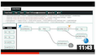

# Spring Cloud Stream TensorFlow Processor

A processor that evaluates a machine learning models built with link:https://www.tensorflow.org/[TensorFlow] and stored
in link:https://developers.google.com/protocol-buffers/[Protocol Buffers] binary format.

The TensorFlow processor leverages internally link:https://www.tensorflow.org/api_docs/java/reference/org/tensorflow/package-summary[TensorFlow Java API] library.

To learn more about this application and the supported properties, please review the following details.

include::spring-cloud-starter-stream-processor-tensorflow/README.adoc[]

To learn how to customize the processor for better fit different TensorFlow models, please review the
 the `Twitter Sentiment` and `Image Recognition` processors below.

---

*Twitter Sentiment Processor* - Extends the `tensorflow-processor` for real-time twitter message sentiment analysis.

include::spring-cloud-starter-stream-processor-twitter-sentiment/README.adoc[]

Video tutorial : link:https://www.youtube.com/watch?v=QzF2Iii4s5c[Real-time Twitter Sentiment Analytics with TensorFlow and Spring Cloud Dataflow]

---

*Image Recognition Processor*  - Real-time image recognition and classification processor. Based on InceptionV3 model
include::spring-cloud-starter-stream-processor-image-recognition/README.adoc[]

Video tutorial : link:https://www.youtube.com/watch?v=bvDM7_CKQjo[Real-time Real-time image recognition ]