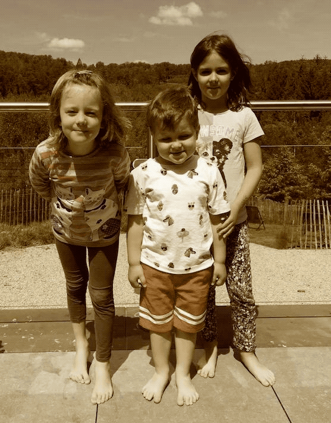

:image-root: https://raw.githubusercontent.com/spring-cloud-stream-app-starters/tensorflow/master/images
# Spring Cloud Stream TensorFlow Processor

A processor that evaluates a machine learning models built with link:https://www.tensorflow.org/[TensorFlow] and stored
in link:https://developers.google.com/protocol-buffers/[Protocol Buffers] binary format.

The TensorFlow processor leverages internally link:https://www.tensorflow.org/api_docs/java/reference/org/tensorflow/package-summary[TensorFlow Java API] library.

To learn more about this application and the supported properties, please review the following details.

include::spring-cloud-starter-stream-processor-tensorflow/README.adoc[]

To learn how to customize the processor for better fit different TensorFlow models, please review the
 the `Twitter Sentiment` and `Image Recognition` processors below.

---

*Twitter Sentiment Processor* - Extends the `tensorflow-processor` for real-time twitter message sentiment analysis.

include::spring-cloud-starter-stream-processor-twitter-sentiment/README.adoc[]

image::{image-root}/VideoIcon.png[]
Video Tutorial: link:https://www.youtube.com/watch?v=QzF2Iii4s5c[Real-time Twitter Sentiment Analytics with TensorFlow and Spring Cloud Dataflow]

---

*Image Recognition Processor*  - Real-time image recognition and classification processor. Based on InceptionV3 model
include::spring-cloud-starter-stream-processor-image-recognition/README.adoc[]

Video tutorial : link:https://www.youtube.com/watch?v=bvDM7_CKQjo[Real-time image recognition]

---

*Object Detection Processor*  - The https://github.com/spring-cloud-stream-app-starters/tensorflow/tree/master/spring-cloud-starter-stream-processor-object-detection[Object Detection] processor provides out-of-the-box support for the https://github.com/tensorflow/models/blob/master/research/object_detection/README.md[TensorFlow Object Detection API]. It allows for real-time localization and identification of multiple objects in a single image or image stream. The Object Detection processor uses one of the pre-trained https://github.com/tensorflow/models/blob/master/research/object_detection/g3doc/detection_model_zoo.md[object detection] models and corresponding https://github.com/tensorflow/models/tree/865c14c/research/object_detection/data[object labels].
include::spring-cloud-starter-stream-processor-object-detection/README.adoc[]

Video Tutorial: link:https://www.youtube.com/watch?time_continue=2&v=2uOtImHKtgI[Real-time Object-Detection With Spring Cloud Stream]

---

*Pose Estimation Processor*

[cols=2*]
|===
| 
| The https://github.com/spring-cloud-stream-app-starters/tensorflow/tree/master/spring-cloud-starter-stream-processor-pose-estimation[Pose Estimation]
  is a real-time, multi-person body pose estimation processor for detecting human figures in images and video. Used to determine, where different body parts
  are located in an image an how they spatially relate to each other.

  Processor is inspired and based on

  - https://arxiv.org/pdf/1611.08050.pdf[Realtime Multi-Person 2D Pose Estimation using Part Affinity Fields]

  - https://github.com/CMU-Perceptual-Computing-Lab/openpose[OpenPose]

  - https://github.com/ildoonet/tf-pose-estimation[tf-pose-estimation]

|===

include::spring-cloud-starter-stream-processor-pose-estimation/README.adoc[]

