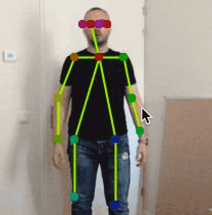
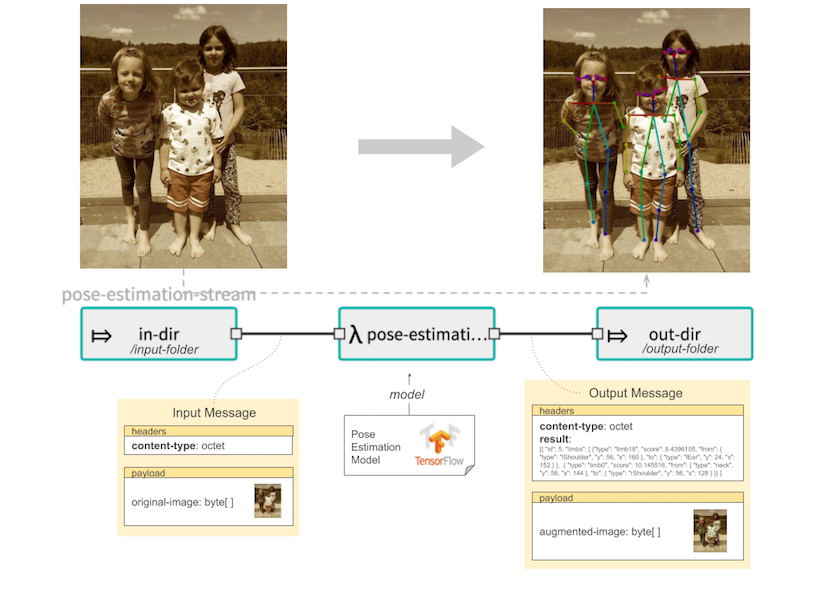

//tag::ref-doc[]
:image-root: https://raw.githubusercontent.com/spring-cloud-stream-app-starters/tensorflow/master/images
= Pose Estimation Processor

[cols=2*]
|===
| Real-time, multi-person Pose Estimation processor for detecting human figures in images and video. Used for determining where different body parts
  are located in an image an how are they spatially relate to each other.

  Processor is based on the https://arxiv.org/pdf/1611.08050.pdf[Realtime Multi-Person 2D Pose Estimation using Part Affinity Fields],
   https://github.com/CMU-Perceptual-Computing-Lab/openpose[OpenPose] and https://github.com/ildoonet/tf-pose-estimation[tf-pose-estimation].
| 
|===


The following diagram illustrates a Spring Cloud Data Flow streaming pipeline that predicts body postures from input images in real-time.

//image::{image-root}/scdf-tensorflow-pose-estimation-arch.png[]


The Pose Estimation processor is configured with a pre-trained Tensorflow model (build with the https://github.com/ildoonet/tf-pose-estimation[tf-pose-estimation] project).
The inference of this model produces auxiliary data structures such a heatmaps with predictions about the parts locations in the image. The post-processing required
for selecting the right body parts and grouping them into poses are implemented by the processor using greedy algorithms.

Use the `tensorflow.model` property to set the pre-trained Tensorflow model. Here are some options available out of the box:

*  `http://dl.bintray.com/big-data/generic/2018-30-05-mobilenet_thin_graph_opt.pb` (default) - fast but less accurate
*  `http://dl.bintray.com/big-data/generic/2018-05-14-cmu-graph_opt.pb` - accurate but slower

Processor's input is an image byte array and the output is a JSON message and optionally an image with annotated body poses.
The output JSON format looks like:

```json
[
    {
        "limbs": [ {"score": 8.4396105, "from": { "type": "lShoulder", "y": 56, "x": 160 }, "to": { "type": "lEar", "y": 24, "x": 152 } },
                   { "score": 10.145516, "from": { "type": "neck", "y": 56, "x": 144 }, "to": { "type": "rShoulder", "y": 56, "x": 128 } },
                   { "score": 9.970467, "from": { "type": "neck", "y": 56, "x": 144 }, "to": { "type": "lShoulder", "y": 56, "x": 160 } } ]
    },
    {
        "limbs": [ {"score": 7.85779, "from": { "type": "neck", "y": 48, "x": 328 }, "to": { "type": "rHip", "y": 128, "x": 328 } },
                   {"score": 6.8949876, "from": { "type": "neck", "y": 48, "x": 328 }, "to": { "type": "lHip", "y": 128, "x": 304 } } ]
   }
]
```

Every entry in the array  represents a single body posture found on the image. Bodies are composed of Parts connected by Limbs represented by the  *limbs* collection.
Every *Limb* instance has a PAF confidence score and the `from` and `to` parts it connects. The *Part* instances have a `type` and coordinates.

NOTE: Output image annotated with body pose skeletons
When the `tensorflow.mode=header` property is set the JSON metadata passed inside the output message header while the payload
contains a copy of the input image. If the `tensorflow.pose.estimation.drawPoses=true` is set the copied input image is
augmented with the poses described in the JSON metadata.

== Options

The **$$pose-estimation$$** $$processor$$ has the following options:

//tag::configuration-properties[]
$$tensorflow.expression$$:: $$How to obtain the input data from the input message. If empty it defaults to the input message payload. The payload.myInTupleName expression treats the input payload as a Tuple, and myInTupleName stands for a Tuple key. The headers[myHeaderName] expression to get input data from message's header using myHeaderName as a key.$$ *($$Expression$$, default: `$$<none>$$`)*
$$tensorflow.mode$$:: $$Defines how to store the output data and if the input payload is passed through or discarded. Payload (Default) stores the output data in the outbound message payload. The input payload is discarded. Header stores the output data in outputName message's header. The the input payload is passed through. Tuple stores the output data in an Tuple payload, using the outputName key. The input payload is passed through in the same Tuple using the 'original.input.data'. If the input payload is already a Tuple that contains a 'original.input.data' key, then copy the input Tuple into the new Tuple to be returned.$$ *($$OutputMode$$, default: `$$<none>$$`, possible values: `payload`,`tuple`,`header`)*
$$tensorflow.model$$:: $$The location of the pre-trained TensorFlow model file. The file, http and classpath schemas are supported. For archive locations takes the first file with '.pb' extension. Use the URI fragment parameter to specify an exact model name (e.g. https://foo/bar/model.tar.gz#frozen_inference_graph.pb)$$ *($$Resource$$, default: `$$<none>$$`)*
$$tensorflow.model-fetch$$:: $$The TensorFlow graph model outputs. Comma separate list of TensorFlow operation names to fetch the output Tensors from.$$ *($$List<String>$$, default: `$$<none>$$`)*
$$tensorflow.output-name$$:: $$The output data key used in the Header or Tuple modes.$$ *($$String$$, default: `$$result$$`)*
$$tensorflow.pose.estimation.body-drawing-color-schema$$:: $$When drawPoses is enabled, one can decide to draw all body poses in one color (monochrome), have every body pose drawn in an unique color (bodyInstance) or use common color schema drawing different limbs.$$ *($$BodyDrawingColorSchema$$, default: `$$<none>$$`, possible values: `monochrome`,`bodyInstance`,`limbType`)*
$$tensorflow.pose.estimation.debug-visualisation-enabled$$:: $$If enabled the inference operation will produce 4 additional debug visualization of the intermediate processing stages:  - PartHeatMap - Part heat map as computed by DL  - PafField - PAF limb field as computed by DL  - PartCandidates - Part final candidates as computed by the post-processor  - LimbCandidates - Limb final candidates as computed by the post-processor  Note: Do NOT enable this feature in production or in streaming mode!$$ *($$Boolean$$, default: `$$false$$`)*
$$tensorflow.pose.estimation.debug-visualization-output-path$$:: $$Parent directory to save the  debug images produced for the intermediate processing stages$$ *($$String$$, default: `$$./target$$`)*
$$tensorflow.pose.estimation.draw-line-width$$:: $$When drawPoses is enabled, defines the line width for drawing the limbs$$ *($$Integer$$, default: `$$2$$`)*
$$tensorflow.pose.estimation.draw-part-labels$$:: $$if drawPoses is enabled, drawPartLabels will show the party type ids and description.$$ *($$Boolean$$, default: `$$false$$`)*
$$tensorflow.pose.estimation.draw-part-radius$$:: $$When drawPoses is enabled, defines the radius of the oval drawn for each part instance$$ *($$Integer$$, default: `$$4$$`)*
$$tensorflow.pose.estimation.draw-poses$$:: $$When set to true, the output image will be augmented with the computed person skeletons$$ *($$Boolean$$, default: `$$true$$`)*
$$tensorflow.pose.estimation.min-body-part-count$$:: $$Minimum number of parts a body should contain. Body instances with less parts are discarded.$$ *($$Integer$$, default: `$$5$$`)*
$$tensorflow.pose.estimation.nms-threshold$$:: $$Only return instance detections that have part score greater or equal to this value.$$ *($$Float$$, default: `$$0.15$$`)*
$$tensorflow.pose.estimation.nms-window-size$$:: $$Non-maximum suppression (NMS) distance for Part instances. Two parts suppress each other if they are less than `nmsWindowSize` pixels away.$$ *($$Integer$$, default: `$$4$$`)*
$$tensorflow.pose.estimation.paf-count-threshold$$:: $$Minimum number of integration intervals with paf score above the stepPafScoreThreshold, to consider the parts connected.$$ *($$Integer$$, default: `$$2$$`)*
$$tensorflow.pose.estimation.step-paf-score-threshold$$:: $$Minimal paf score between two Parts at individual integration step, to consider the parts connected$$ *($$Float$$, default: `$$0.1$$`)*
$$tensorflow.pose.estimation.total-paf-score-threshold$$:: $$Minimal paf score between two parts to consider them being connected and part of the same limb$$ *($$Float$$, default: `$$4.4$$`)*
//end::configuration-properties[]

//end::ref-doc[]
== Build


```
$ ./mvnw clean install -PgenerateApps
$ cd apps
```
You can find the corresponding binder based projects here.
You can then cd into one of the folders and build it:
```
$ ./mvnw clean package
```

== Examples

```
java -jar pose-estimation-processor.jar --tensorflow.model= --tensorflow.modelFetch= --tensorflow.mode=
```

And here is a example pipeline that process images in `file` source and outputs the annotated images to `file` sink directory:

```
pose-estimation-stream=in: file --directory='/tmp/images'
| pose-estimation --tensorflow.mode=header --tensorflow.model='http://dl.bintray.com/big-data/generic/2018-05-14-cmu-graph_opt.pb'
| out: file --directory='/tmp/output' --name-expression='headers[file_name]'
```

