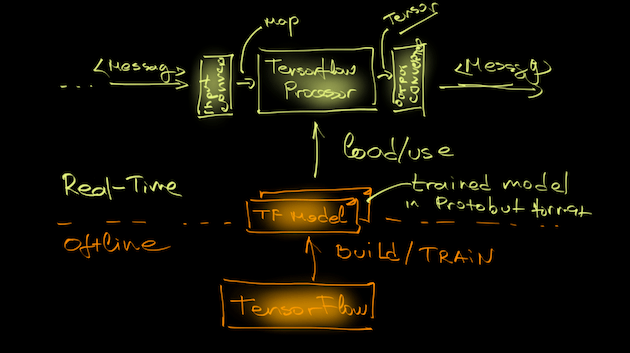

//tag::ref-doc[]
= TensorFlow Processor

A processor that evaluates a machine learning model stored in TensorFlow Protobuf format.



The TensorFlow Processor uses a `TensorflowInputConverter` to convert the input data into data format compliant with the
TensorFlow Model used. The input converter converts the input `Messages` into key/value `Map`, where
the Key corresponds to a model input placeholder and the content is `org.tensorflow.DataType` compliant value.
The default converter implementation expects either Map payload or flat json message that can be converted into a Map.

The `TensorflowInputConverter` can be extended and customized. See link::../spring-cloud-starter-stream-processor-twitter-sentiment/src/main/java/org/springframework/cloud/stream/app/twitter/sentiment/processor/TwitterSentimentTensorflowInputConverter.java[TwitterSentimentTensorflowInputConverter.java] for example.

Processor's output uses `TensorflowOutputConverter` to convert the computed `Tensor` result into a serializable
message. The default implementation uses `Tuple` triple.

Custom `TensorflowOutputConverter` can provide more convenient data representations.
See link::../spring-cloud-starter-stream-processor-twitter-sentiment/src/main/java/org/springframework/cloud/stream/app/twitter/sentiment/processor/TwitterSentimentTensorflowOutputConverter.java[TwitterSentimentTensorflowOutputConverter.java].


Following snippet shows how to export any `TensorFlow` model (trained as well) into `ProtocolBuffer` binary format as required by the Processor.
```python
from tensorflow.python.framework.graph_util import convert_variables_to_constants
...
SAVE_DIR = os.path.abspath(os.path.curdir)
minimal_graph = convert_variables_to_constants(sess, sess.graph_def, ['<model output>'])
tf.train.write_graph(minimal_graph, SAVE_DIR, 'my_graph.proto', as_text=False)
tf.train.write_graph(minimal_graph, SAVE_DIR, 'my.txt', as_text=True)
```

== Options

The **$$tensorflow$$** $$processor$$ has the following options:

//tag::configuration-properties[]
$$tensorflow.input-expression$$:: $$Specifies where to obtain the input data from. By default it looks
 at the {@link org.springframework.messaging.Message}'s payload.
 Instead one can obtain the input value from a payload {@link org.springframework.tuple.Tuple} like this:
 'tensorflow.inputExpression=payload.myInTupleName', where myInTupleName is a Tuple key.
 To obtain input date from the message headers use expression like this:
 'tensorflow.inputExpression=headers[myHeaderName]', where is the name of the header that contains the input data.$$ *($$String$$, default: `$$payload$$`)*
$$tensorflow.model-location$$:: $$The location of the Tensorflow model file.$$ *($$Resource$$, default: `$$<none>$$`)*
$$tensorflow.output-index$$:: $$The model graph output index$$ *($$Integer$$, default: `$$0$$`)*
$$tensorflow.output-name$$:: $$The model graph output name$$ *($$String$$, default: `$$<none>$$`)*
$$tensorflow.result-header$$:: $$Controls if the inference result would be carried in the {@link org.springframework.messaging.Message} payload
 or in header.
 If the resultHeader is empty (default) the result is carried in the payload. If not empty then the result is
 carried in the header using the resultHeader name.

 When multiple tensorflow processors in a single pipeline carry their results in the header make sure they
 are configured with distinct resultHeader names.$$ *($$String$$, default: `$$<none>$$`)*
//end::configuration-properties[]

//end::ref-doc[]
== Build

```
$> mvn package
```
