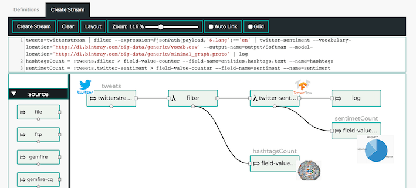

//tag::ref-doc[]
= Twitter Sentiment Analysis Processor

A processor that evaluates a machine learning model stored in TensorFlow Protobuf format.
It operationalizes the https://github.com/danielegrattarola/twitter-sentiment-cnn



link:https://www.youtube.com/watch?v=QzF2Iii4s5c[Real-time Twitter Sentiment Analytics with TensorFlow and Spring Cloud Dataflow]

== Options

The **$$twitter-sentiment$$** $$processor$$ has the following options:

//tag::configuration-properties[]
$$tensorflow.input-header$$:: $$If not empty, the processor will use the inputHeader content as data input instead of message's payload.$$ *($$String$$, default: `$$<none>$$`)*
$$tensorflow.model-location$$:: $$The location of the Tensorflow model file.$$ *($$Resource$$, default: `$$<none>$$`)*
$$tensorflow.output-index$$:: $$The model graph output index$$ *($$Integer$$, default: `$$0$$`)*
$$tensorflow.output-name$$:: $$The model graph output name$$ *($$String$$, default: `$$<none>$$`)*
$$tensorflow.result-header$$:: $$Controls if the inference result would be carried in the {@link org.springframework.messaging.Message} payload
 or in header.
 If the resultHeader is empty (default) the result is carried in the payload. If not empty then the result is
 carried in the header using the resultHeader name.

 When multiple tensorflow processors in a single pipeline carry their results in the header make sure they
 are configured with distinct resultHeader names.$$ *($$String$$, default: `$$<none>$$`)*
$$tensorflow.twitter.vocabulary-location$$:: $$The location of the word vocabulary file.
 Note: the vocabulary must be the same used for training the model$$ *($$Resource$$, default: `$$<none>$$`)*
//end::configuration-properties[]

//end::ref-doc[]
== Build

```
$> mvn package
```
